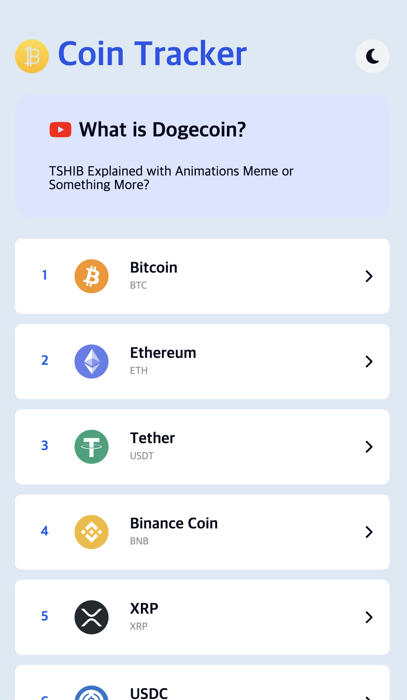
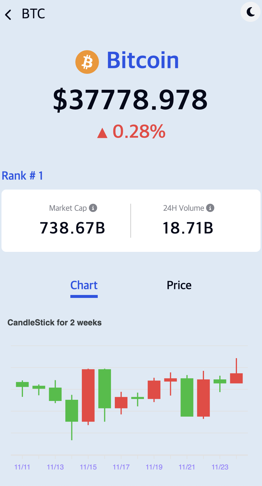
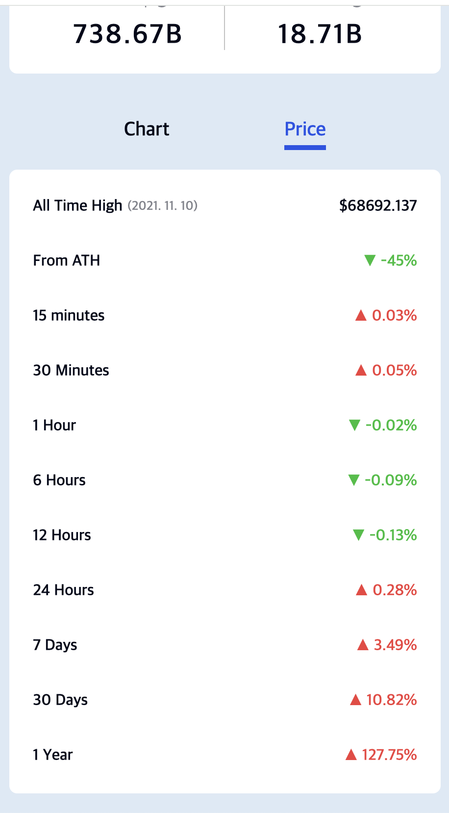
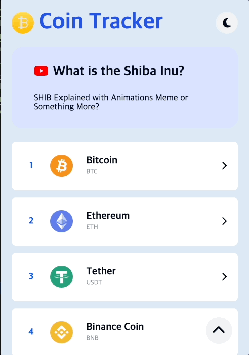
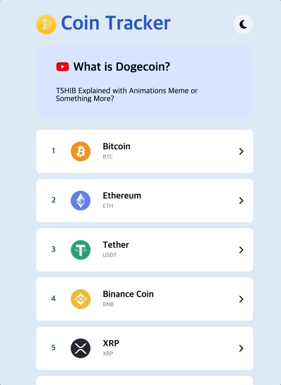
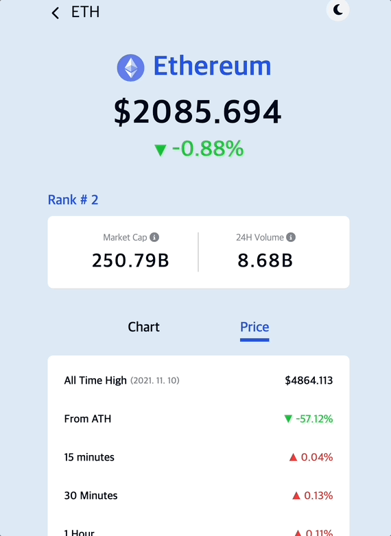

# Coin Tracker

## 🙋‍♂️ 프로젝트 소개

### TypeScript + React를 사용해 암호화폐 목록과 시세를 보여주는 사이드 프로젝트입니다.

|                       메인                       |                          차트                           |                          가격                           |
| :----------------------------------------------: | :-----------------------------------------------------: | :-----------------------------------------------------: |
|  |  |  |

## 🛠 개발환경

       
 

### ⛓ node_modules

| 모듈명           | 용도                |
| ---------------- | ------------------- |
| axios            | 서버 통신           |
| recoil           | 전역 상태관리       |
| react-tooltip    | 추가설명            |
| react-rotuer-dom | 라우팅 구현         |
| react-query      | 서버 상태 관리  |
| react-Helmet     | title 메타테그 설정 |
| apexcharts       | 차트 시각화         |

 

## 주요 기능

### [메인 페이지]

### React Query 사용

- 메인 페이지에서 가장 많이 거래되는 코인목록 Top100을 받아옵니다.
- `React-Query`에서 제공하는 **useQuery Hook** 을 사용해 API 요청시 코인 데이터를 받아옵니다. 
  useQuery Hook을 이용하여 데이터를 요청하면 결과가 자동으로 **캐싱**되어, 동일한 쿼리가 여러 번 호출될 때 네트워크 요청을 반복하지 않고 첫 번째 호출에서 받은 데이터를 재사용함으로써 성능을 향상시킬 수 있습니다.

### 다크모드

- styled-components, recoil를 이용하여 다크모드를 구현하였으며, 부드럽게 전환되도록 transition을 적용하였습니다.
- `recoil`을 통해 다크모드 상태값(isDark atom)을 전역 관리하여 불필요한 **Prop Drilling**을 방지하고
   styled-components에서 제공하는 `ThemeProvider`를 사용하여 다크모드 상태값에 따라 theme를 적용하였습니다.

### 기타 기능

- 페이지 우측 하단에 스크롤 맨 위로 이동할 수 있는 TOP 버튼을 배치하였습니다.
- CSS animation으로 상단 배너 슬라이드(상위권 코인들의 정보를 담은 유튜브 영상 링크)를 구현하였습니다.

 

### [상세 페이지]

홈에서 선택한 해당 코인의 상세 정보를 확인할 수 있습니다.
코인 정보들을 시각화한 **Chart**와 **Price** 페이지를 볼 수 있습니다.

### Chart

- 차트 시각화 라이브러리인 `ApexChart.js`를 사용해 API로부터 가져온 최근 2주간의 가격 흐름을 **Candlestick**로 나타냈습니다.
- Candlestick 정보가 없는 코인들도 존재하여 그럴경우에는 에러 문구를 나태내도록 설정했습니다.

### Price

 

- 24시간 거래량, 24시간 동안의 시가 총액 변화, 역대 최고가, 역대 최고가와 현재 가격에 대한 백분율 차이를 담은 가격표입니다. 
- 하향가 퍼센트와 상향가 퍼센트 색을 다르게 설정하여 직관적으로 하향/ 상향과의 차이를 볼 수 있게 설정했습니다.
- `react-tooltip`을 사용하여, 마우스 hover시 구체적인 용어 설명을 추가로 나타냈습니다.

### 🛠 프로젝트 관리

- <a href="https://github.com/junny97/CoinTracker/issues">GitHub Issue</a>
  - 빠른 issue 생성을 위해 issue 템플릿을 만들어 사용하였습니다.
  - issue label을 생성하여 어떤 작업을 히는지 구분하였습니다.
  - issue를 통해 구현할 내용과 체크리스트를 만들어 어떤 작업을 할지 리스트 만들어 관리하였습니다.

### 📃 커밋 메시지 컨벤션

| 타입     | 설명                                                    |
| -------- | ------------------------------------------------------- |
| Feat     | 새로운 기능 추가                                        |
| Fix      | 버그 수정                                               |
| Style    | CSS 등 사용자 UI 디자인 변경                            |
| Refactor | 코드 리팩토링 (더 효율적인 코드로 변경 등)(기능은 동일) |
| Chore    | 라이브러리 설치, 패키지 매니저 수정                     |
| Docs     | 리드미 등 문서작업 수정                                 |
